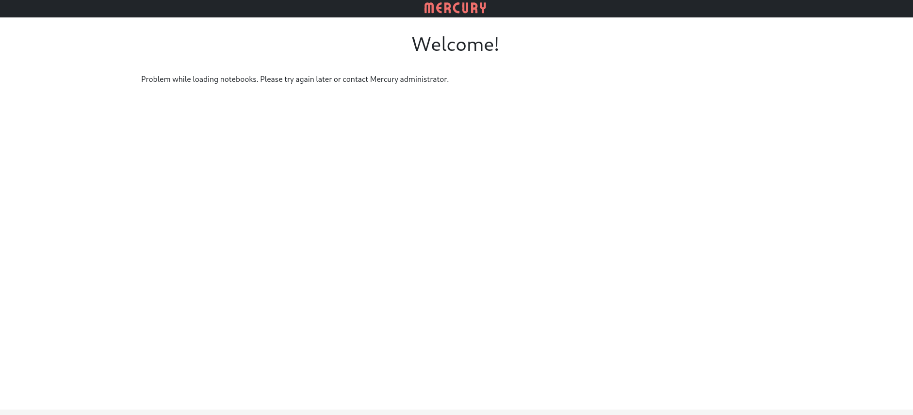

Mercury-Docker-Demo

>  A simple demo project for Mercury.


##  Run

Clone the repo


With docker installed, you can run the following command from the root directory to start the demo:


```bash
docker-compose up --build
```




